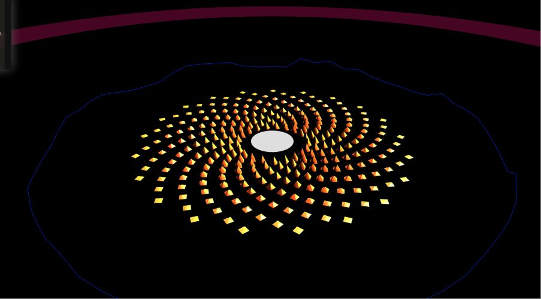

# Lotus Audio

[Demo](https://lotusaudio.herokuapp.com)
[Github](https://github.com/amitlzkpa/lotusweb)

Architecture has often been used as a background for creating and experiencing music. This project looks to invert that relationship by using any given audio to create virtual 3D environments. Using VR these environments can be experienced as if one was inhabiting the environment.
The process of going from audio signals to a 3D environment involves deconstruction the audio into numbers which can be used as an input into parametric algorithms for creating 3D forms. Often the inspiration for such designs has been to express a relationship between an environment and other abstract concepts, supported by engineering and design to make the environments habitable and functional.
The ephemeral medium of virtual environments remove the shackles of real world and allow for more experimental habitats and enjoyable experiences. The demo application explores a few such concepts by exposing parametric relationships established in architectural design but augmenting them to react to music in real time creating a dynamic music driven world.
