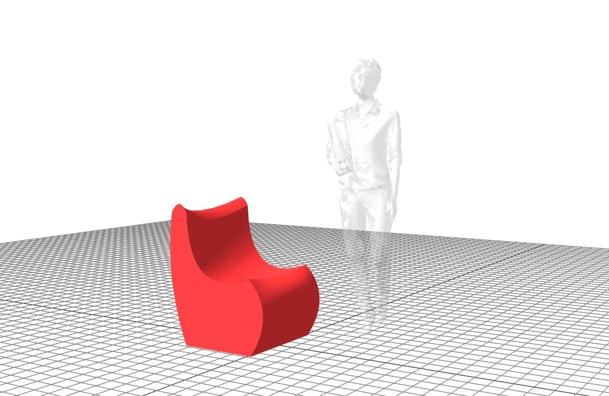

# O-LAP

[Project Page](https://o-lap.org)
[Demo](https://o-lap.org/app.html?a=amitlzkpa&r=o-lap_plato)
[Github](https://github.com/O-LAP/home)

O-LAP is an open-source community run platform for designers to experiment with parametric furniture design. It used JavaScript as a scripting language to design parametric furniture which can be fabricated out of plywood. The idea explores several questions about design thinking, ownership, collaboration, standards and fabrication. I am the sole maintainer of this community and building towards a collaborative design community as a part of this effort. I have had the opportunity to present the idea at a couple of conferences and it is still in active development.
