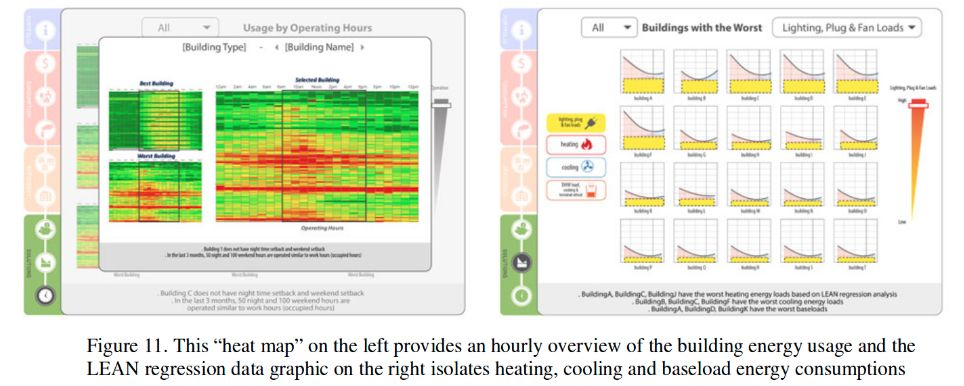

# Standard Energy Efficiency Data (SEED) Platform

[Project Page](https://www.energy.gov/eere/buildings/seed-platform-frequently-asked-questions)
[Publication](https://aceee.org/files/proceedings/2016/data/papers/4_784.pdf)
[Demo Video](https://www.youtube.com/watch?v=JNhq2IZn2zM)

Standard Energy Efficiency Data (SEED) is a platform for building managers to analyse and visualise data to understand building performance. It provides intuitive dashboards for the property managers to help them make decisions.
The applications works on data collected from building meters and sensors which is stored in different databases. It fetches this data and performs different analysis based on the type of analysis required and the availability of data suitable for specific kinds of analysis. Based on this a dashboard is presented for property managers to view the different analysis as per availability and their subscription plan.

Developed as part of research team with Professor Azizan Aziz at Carnegie Mellon University. I was part of the team developing the charting and UI from the analysis data for the web application. The project was presented at ACEEE Summer Study of Energy Efficiency in Buildings 2016.

