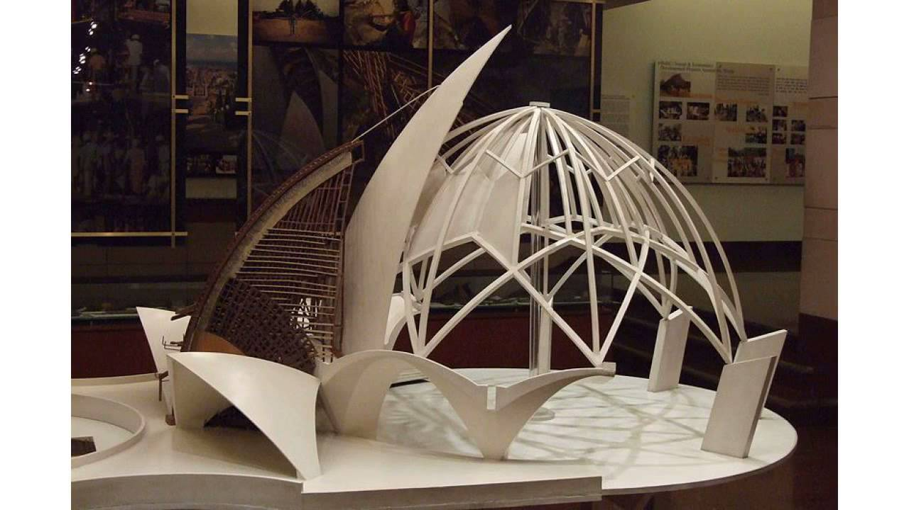
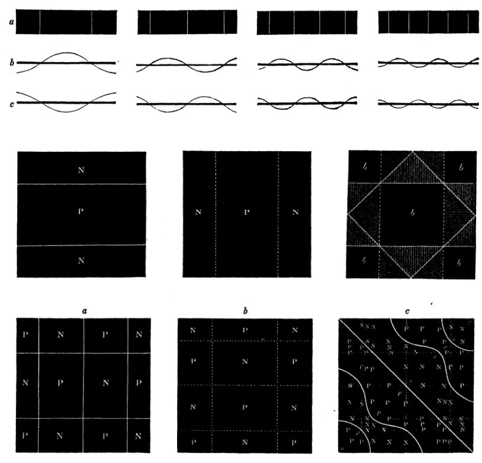
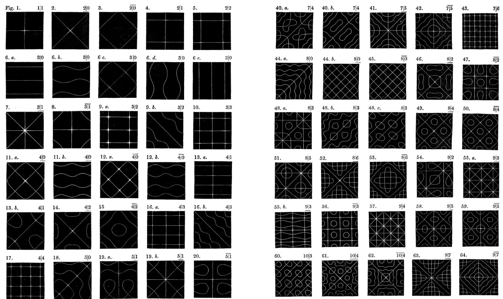

# Visual Acoustics

This article details my thought and design process in creating music visualizations.  

[**DEMO**](https://lotusaudio.herokuapp.com/view/5ee4fe4610a0ec114483fd4e)  
<iframe width="100%" height="300" src="https://www.youtube.com/embed/c3BxyjRjNew" frameborder="0" allow="accelerometer; autoplay; encrypted-media; gyroscope; picture-in-picture" allowfullscreen></iframe>  

This project started with an experience I had while I was in a temple. I was visiting The Lotus Temple in New Delhi when me and a friend happened to be there at the same time as the temple prayers were in process.  

It was a very special experience for us. The temple belongs to the Baha'i faith. The Baha'i is a religion teaching the essential worth of all religion. In accordance with that they recite prayers from several different religions and we happened to chance upon one such sermon.  

Beyond the depth of the prayer itself the acoustic ambience of the prayer hall elevated the entire experience for us. What was even more touching was the fact that hymns and prayers developed in different cultures in different periods of time was being recited in the same foyer and yet felt aptly suited to leave a deeply touching impression on us.  

  
_ARwkmedia / CC BY-SA [https://commons.wikimedia.org/wiki/File:Lotus_Temple.png]_  

It made me really curious about the space in which we were having the experiencing and about qualities in general which make a space suited for acoustical performances. Having trained as an architect I was aware of the rigour involved designing a space for acoustical performance.  

Yet this particular instance caught my attention as the space was designed to be beautiful in its visual appeal as much as it's auditory experience. The structure of the temple is designed as 9 sided radially symmetrical enclosure with 3 petal like shapes in each side.  

  
_Dinudey Baidya from Bangalore, India / CC BY [https://commons.wikimedia.org/wiki/File:Interior_of_Lotus_temple.jpg]_  

It is a design envisioned by Ar. Fariborz Sahba and it's construction was completed in 1986. The 27 petals and the dome form a thin barrier between the interior and exterior worlds. Within its internal world it marvelously creates a cocoon for moments of quiet introspection within the metropolis of New Delhi.  

  
_Wiki-uk / CC BY-SA [https://commons.wikimedia.org/wiki/File:104-Lotus-Temple-Information-Centre.JPG]_  

Sound as I learnt in school are waves flowing through air. It is an excitation of a medium - like air - which transmits energy in the form of waves emanating from a source. A wave is a series of compressions and rarefactions of the medium changing over time.  

Honestly speaking this made no sense to me when I tried to learn it for the first time. When I read about it they explained it with squiggly lines which got me confused.  

I stumbled upon the following experiment which helped me get a better understanding.  
<iframe width="100%" height="300" src="https://www.youtube.com/embed/wvJAgrUBF4w" frameborder="0" allow="accelerometer; autoplay; encrypted-media; gyroscope; picture-in-picture" allowfullscreen></iframe>  

A quick description of what's going on here:  
The instrument below is called a tone generator which is the source of the sound in this experiment. Once it starts it shakes the plate at regular intervals. This is how speakers recreate recorded sounds. On top they've sprayed some sand which are free to move around. When the device starts it emits sound of a set frequency.  

As the sound plays it vibrates the plate itself which create "waves" along the plate. The waves intersect with each other and creates regions of amplified excitation (nodes) and regions where both waves cancel each other out (anti-nodes).  

  
_On the Figures obtained by streuing Sand on Vibrating Suifaces, commonly called Acoustic Figures._  

If a sand particle is at a position of low vibration it stays where it is and if it's a point of high vibration it moves away from it. That leads to the creation of such patterns.  

This research was conducted by Ernst Chladni in 1833 and fundamentally holds true for any surface that is acting as a sound board.  

The patterns correspond to the size of the board and the frequencies the board is subject to. You can create many more wild patterns with different configurations and this inspired me to create a design based on it.  

Here are some more patterns he observed in his study:  
  
_On the Figures obtained by streuing Sand on Vibrating Suifaces, commonly called Acoustic Figures._  

With this visualization I'm attempting to visualise the interference pattern we saw in a virtual 3d environment. We just saw how we can derive the patterns for a flat plate. However that is only a slice of the real thing.  

In reality sound is 3d propagating in all directions simultaneously. I'm trying to visualise this in a virtual 3d environment. While we held clean frequencies for the experiment we just saw, for my experiment I'm using any available audio source and parse it into it's constituent frequencies using the WebAudioAPI.  

There's more cleanup with involved with how I'm reading and parsing the audio data since the amount of information available is too vast for me to try to visualise. Parts where I've allowed myself creative freedom are those where if were to attempt visualising the real thing it'd look meaningless. Eg. A 2khz signal is vibrating it's medium 2000 times a second which would be very difficult to see.  

With that let me launch into the experiment and show some visualizations.  

## Simple Sine Wave
<iframe width="100%" height="300" src="https://www.youtube.com/embed/mfqos-fU8cw" frameborder="0" allow="accelerometer; autoplay; encrypted-media; gyroscope; picture-in-picture" allowfullscreen></iframe>

## Double Wave Interference
<iframe width="100%" height="300" src="https://www.youtube.com/embed/uZeICbbfJfs" frameborder="0" allow="accelerometer; autoplay; encrypted-media; gyroscope; picture-in-picture" allowfullscreen></iframe>

## Triple Wave Interference (different locations)
<iframe width="100%" height="300" src="https://www.youtube.com/embed/BLT0xMRA4Go" frameborder="0" allow="accelerometer; autoplay; encrypted-media; gyroscope; picture-in-picture" allowfullscreen></iframe>

## Double Wave Interference (different locations)
<iframe width="100%" height="300" src="https://www.youtube.com/embed/eENE1bLa00g" frameborder="0" allow="accelerometer; autoplay; encrypted-media; gyroscope; picture-in-picture" allowfullscreen></iframe>

## Highs, Mds and Lows Interference (different locations) - Sine Chirp
<iframe width="100%" height="300" src="https://www.youtube.com/embed/c3BxyjRjNew" frameborder="0" allow="accelerometer; autoplay; encrypted-media; gyroscope; picture-in-picture" allowfullscreen></iframe>

Those were  some examples which I think are really fun. You can actually load up any sound file you may have and try to visualise it this way.
You can choose to experience the whole thing in VR if you have a headset. That's something that really awesome and I can highly recommend.  

I'm still in the process of creating more visuals. Things I'd like to experiment with further include analysing the effect of different frquencies and variation in patterns created by changing its pitch and location. For the visuals I'm keen to move towards a more volumetric experience and maybe use colours in some meaningful way.  